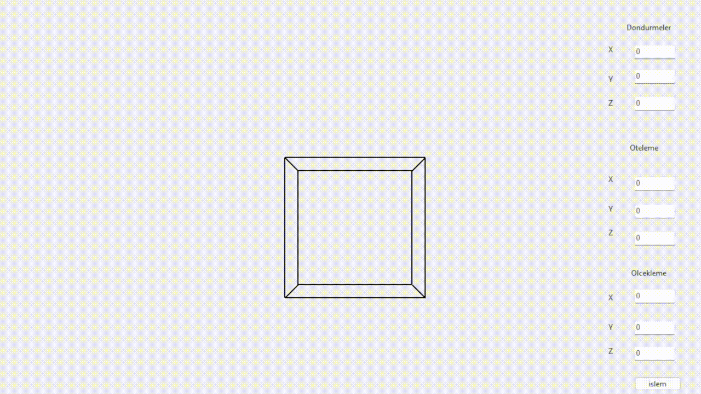

# 3D geometric transformations
A program that performs 3D geometric transformations. Multiple transformations can be applied simultaneously.

All operations are performed accroding to matrices in website below
<a href="https://medium.com/swlh/understanding-3d-matrix-transforms-with-pixijs-c76da3f8bd8" target="_blank">Matrices</a>
